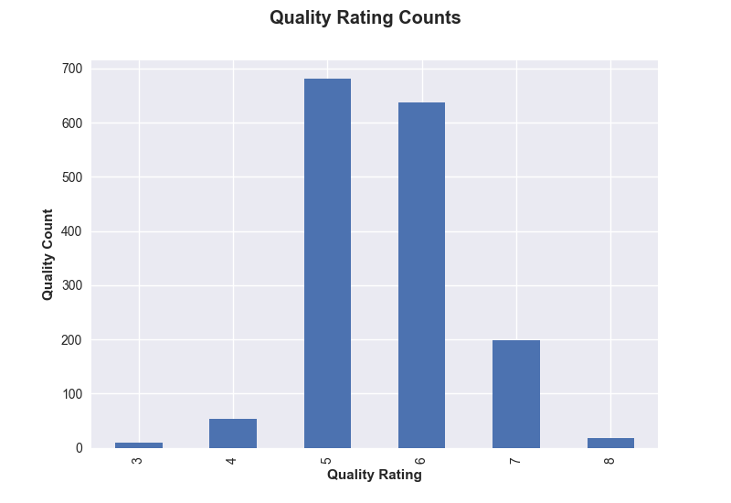
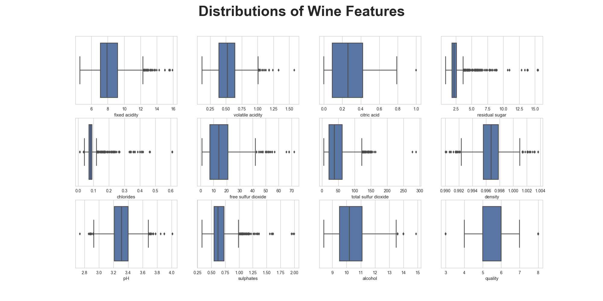
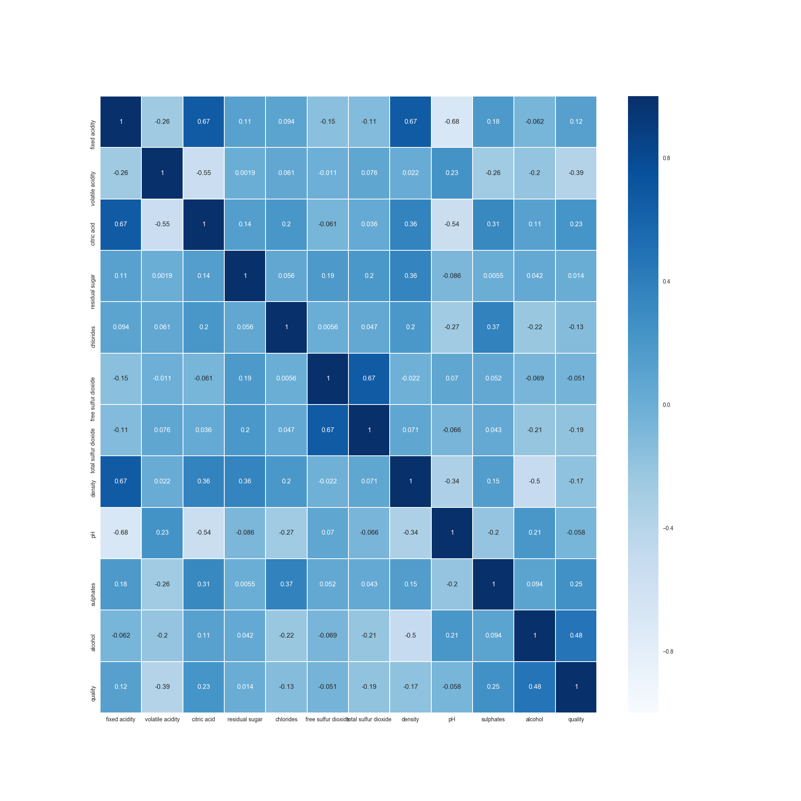
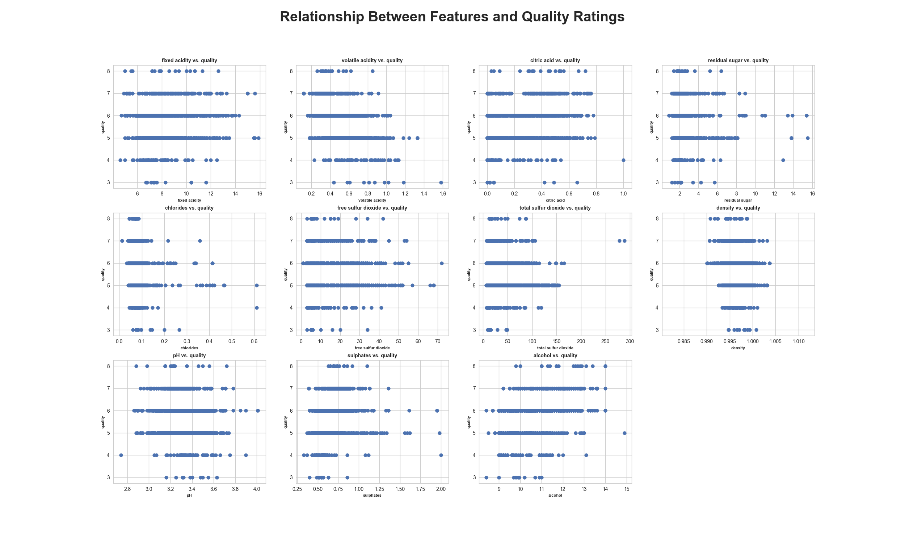

# UCI Wine Quality Dataset Analysis

## Table of Contents
1. [Introduction](#introduction)
2. [Exploratory Data Analysis](#eda)
3. [Wine Quality Modeling](#wine-quality-modeling)
4. [Random Forest Results](random-forest-classifier-results)
5. [Gradient Boosting Results](gradient-boosting-classifier-results)
6. [Conclusion](conclusion)

### Introduction

This wine quality dataset comes from UC Irvine's Machine Learning Repository (https://archive.ics.uci.edu/ml/datasets/wine+quality). The purpose of this analysis is to determine if we can accurately predict the quality of wine based off some of its chemical properties such as pH and sugar levels. There are two separate datasets - one for red wine and the other for white - but only the red wine dataset is analyzed here.

### EDA

The chemical properties of the wines are all continuous variables.
Quality ratings can range from 1 through 10, where lower values represent poorer quality, middle values represent normal quality, and higher values represent excellent quality. This dataset, however, only contains data with quality values from 3 through 8 and is unbalanced, with more data points in the normal quality value range as seen in Figure 1 below.

Lucky for us, the dataset was cleaned up by UCI prior to posting in their repository so there are no null values present.

Next, I looked at the distribution of each of the predictor variables and found many have outliers, usually above the upper threshold to be considered an outlier. Again, since the dataset was cleaned up, I don't expect any errors with how the data in this set was collected. I looked at the quality values of the outliers for each chemical property and most had similar ratings. Therefore, points with outliers were kept in the dataset as they could contain important information in finding a relationship between wine properties and their qualities. The boxplots for each variable are in Figure 2 below.

Figure 3 is a heatmap illustrating the correlations between all the variables. One thing that caught my attention were the two columns, free sulfur dioxide and total sulfur dioxide, which have a relatively high correlation in the heatmap. I'm not a chemistry or wine expert but my hunch was that total SO2 might be a combination of free sulfur dioxide and something else. This thought was confirmed after doing some research so I removed the free sulfur dioxide column to remove redundancy in the features.

There are also other variables that appear to be correlated but I did not conduct further research so more professional input could be used here. Free and total sulfur dioxide seemed like an immediate dead giveaway that there could be some redundancy there.

I explored the relationship between each feature and quality using the plots in Figure 4. Another reason why I wasn't too concerned with correlation between the variables is there does not seem to be any clear linear relationships between any of the predictor variables and the response so I am not planning on using any regressors or models where performance would be impacted by correlation. The relationship between alcohol levels and quality seems to be the strongest, which can be seen in the heatmap and the scatterplot, but the correlation level is still only 0.48.

### Wine Quality Modeling

As stated, I have decided not to use a logistic regressor since the relationships between each of the predictor variables and quality appear to be more complex than a linear one. For this analysis, I looked at how well a relationship could be modeled by using a Random Forest Classifier and a Gradient Boosting Classifier. Although these two classifiers are complex algorithms, we can still determine which features are most important in modeling wine quality, given that we even find a relatively strong relationship between predictors and the response.

The data is split in train and test sets. The train set is then cross-validated via GridSearch, which is used to find optimal parameters for each of the classifiers. Even though there is class imbalance, the train and cross validated sets are stratified to ensure there are training points with each quality value. The performance of the model is validated by testing it on the hold out test set.

Here I am going to evaluate the classifiers based on their accuracy scores since we care about all the correct and incorrect predictions they make. I briefly discuss the effect of class imbalance in the conclusion.

### Random Forest Classifier Results

After finding the best parameters for the Random Forest classifier, the training accuracy is 68.64% and the accuracy calculated with the hold out test set is 68%. A rough sketch of the confusion matrix based on the test set is below.

    3    0   0   1   0   0   0
 T  4    0   0   7   6   0   0
 R  5    0   0 129  34   1   0
 U  6    0   0  41 118  10   0
 E  7    0   0   0  22  25   1
    8    0   0   0   0   5   0

         3   4   5   6   7   8
              PREDICTED

### Gradient Boosting Classifier Results

With the optimal parameters found by GridSearch, the training accuracy is 65.64% and the test accuracy is 65%. The confusion matrix is below.

    3 [[  0   0   1   0   0   0]
 T  4  [  0   1   8   4   0   0]
 R  5  [  1   0 123  39   1   0]
 U  6  [  0   2  33 115  16   3]
 E  7  [  0   0   0  25  21   2]
    8  [  0   0   0   1   4   0]]
          3   4   5   6   7   8
               PREDICTED

### Conclusion

Unfortunately, there does not appear to be an accurate way to predict wine qualities based off their chemical properties. Because I was not able to reach an accuracy higher than 80%, I did not move forward with looking at feature importances.

Of course here I only looked at two different classifiers so it might be worth trying some others to see if they perform better with this dataset.

Also, using accuracy as an evaluation metric with an imbalanced dataset might be overstating the performance of the models. I looked at some analyses done by others on this dataset and they tended to modify and narrow the response variable to different quality levels such as 'bad', 'good', 'excellent' to handle the class imbalance. I tried to use a different approach by using SMOTE to create synthetic data to cancel out the imbalance. However, my models were overfitting the train data and I still wasn't able to get a test accuracy score above 70%. The code implementing SMOTE is in the modeling script.
